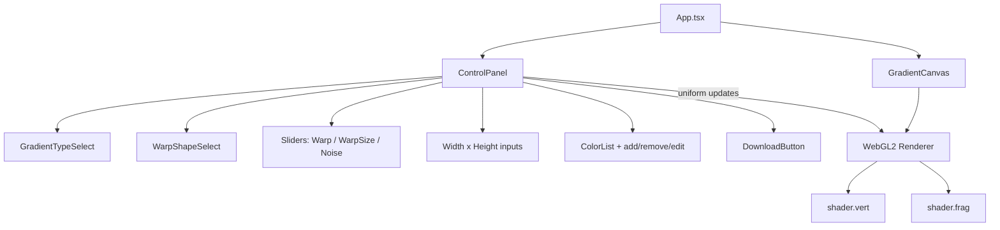

# Mesh Gradient Generator — Full Replica

## Architecture



## Tech Stack

- **Vite + React 19 + TypeScript** (using **Bun** as package manager and task runner)
- **Raw WebGL2** for rendering (no p5.js)
- **GLSL shaders** — the complete fragment shader (611 lines) extracted from photogradient.com, plus the trivial vertex shader
- **Chakra UI v3** — component library with token-centric styling (Emotion engine, recipes)
- **Zustand** — lightweight state management for shared gradient state
- **react-colorful** — tiny (~2KB) color picker for editing hex values
- **framer-motion** — UI animations (panel transitions, anchor point drag physics)
- **vite-plugin-glsl** — clean GLSL imports with `#include` support
- **No backend** — fully client-side

## Project Structure

```
mesh-gradient-generator/
  src/
    main.tsx                          # Entry point, Chakra provider
    App.tsx                           # Root layout (canvas + panel)
    theme.ts                          # Chakra UI v3 theme config / tokens

    store/
      gradientStore.ts                # Zustand store: all gradient state + actions

    hooks/
      useWebGLRenderer.ts             # WebGL2 lifecycle: compile, render, uniforms

    components/
      ui/                             # Atomic / molecular UI components
        Button.tsx
        IconButton.tsx
        Slider.tsx                    # Labeled slider with Chakra Slider
        Select.tsx                    # Styled select dropdown
        NumberInput.tsx               # W/H dimension inputs
        ColorSwatch.tsx               # Small colored circle + hex label
        ColorPicker.tsx               # Popover with react-colorful HexColorPicker
        ColorAnchorPoint.tsx          # Draggable anchor point overlay on canvas
      sections/                       # Composed UI sections
        GradientCanvas.tsx            # Canvas + WebGL + anchor point overlay
        ControlPanel.tsx              # Full right-hand controls panel
        ColorList.tsx                 # List of color swatches with add/remove/edit
        ExportBar.tsx                 # Download button + dimension controls

    shaders/
      shader.vert                     # Vertex shader (pass-through)
      shader.frag                     # Fragment shader (611 lines, complete algorithm)

    lib/
      webgl.ts                        # WebGL utility functions (compile, link, etc.)
      colors.ts                       # Hex-to-RGB, palette presets, random palette
      export.ts                       # PNG download via offscreen canvas

    types.ts                          # Shared TypeScript types
  index.html
  package.json
  vite.config.ts
  tsconfig.json
```

## Core Implementation Details

### 1. GLSL Shaders (already extracted, complete)

The fragment shader contains:

- **5 gradient functions**: `calculateEnhancedBezier` (Sharp Bezier), `calculateBezierGradient` (Soft Bezier), `calculateMeshGradient` (Mesh Static), `calculateMeshGradient2` (Mesh Grid), `calculateOriginalWarpGradient` (Simple)
- **14 warp shapes**: simplex, circular, value noise, worley, FBM, voronoi, domain warping, waves, smooth, oval, rows, columns, flat, gravity
- **Noise overlay**: random noise mixed into final color via `u_noiseRatio`
- **Main function**: applies warp, selects gradient type, applies noise

Both shaders imported cleanly via `vite-plugin-glsl` (e.g., `import fragShader from './shader.frag'`).

### 2. WebGL2 Renderer (`useWebGLRenderer.ts`)

- Compile and link the two shaders into a program
- Create a full-screen quad (two triangles covering clip space)
- Cache uniform locations for all 11 uniforms
- Expose an `updateUniforms(values)` function
- Render on demand (not a continuous loop) — re-render only when parameters change
- For export: temporarily resize canvas to export dimensions, render once, extract via `canvas.toBlob()`

Key uniforms to map:

- `u_resolution`: `vec2` — canvas width/height devicePixelRatio
- `u_time`: `float` — 0.0 (static) or millis/1000 (if motion enabled)
- `u_noiseTime`: `float` — 0.0
- `u_bgColor`: `vec3` — first color as normalized RGB
- `u_colors[10]`: `vec3[10]` — all colors as normalized RGB
- `u_positions[10]`: `vec2[10]` — normalized 0..1 positions
- `u_numberPoints`: `int`
- `u_noiseRatio`: `float` (default 0.08)
- `u_warpRatio`: `float` (default 0.4)
- `u_warpSize`: `float` (default 1.0)
- `u_gradientTypeIndex`: `int` (default 4 = Sharp Bezier)
- `u_warpShapeIndex`: `int` (default 2 = Value Noise)
- `u_mouse`: `vec2` — normalized mouse position

### 3. Interactive Color Anchor Points

- Each color point rendered as a `ColorAnchorPoint` component — an absolutely-positioned HTML element overlaying the canvas
- White outer ring + inner fill matching the point's hex color (matching the original's visual style)
- Draggable via `framer-motion`'s `drag` prop with `dragConstraints` bound to the canvas container — gives smooth, physics-based dragging
- On drag end, normalized positions (0-1) written to the Zustand store, triggering a WebGL re-render
- Points shown on hover (canvas `mouseenter`/`mouseleave` toggles visibility with a fade via `AnimatePresence`)

### 4. Zustand Store (`gradientStore.ts`)

Single store, clean action API. Any component can read/write without prop drilling.

```typescript
interface GradientStore {
  // State
  colors: ColorPoint[]; // { id, hex, position: [x, y] }
  gradientTypeIndex: number; // 0-4
  warpShapeIndex: number; // 0-13
  warpRatio: number; // 0..1
  warpSize: number; // 0..5
  noiseRatio: number; // 0..1
  width: number; // export width
  height: number; // export height

  // Actions
  setParam: (key, value) => void;
  setColorHex: (id, hex) => void;
  setColorPosition: (id, pos) => void;
  addColor: (hex) => void;
  removeColor: (id) => void;
  randomizePositions: () => void;
  loadPalette: (palette) => void;
}
```

The store is the single source of truth. `GradientCanvas` subscribes to it for rendering. `ControlPanel` subscribes to it for display and writes back via actions.

### 5. Controls Panel

- **Gradient type** dropdown: Sharp Bezier, Soft Bezier, Mesh Static, Mesh Grid, Simple
- **Warp shape** dropdown: all 14 options
- **W / H** inputs: custom dimensions (default 2560 x 1440)
- **Warp** slider: 0..1 (default 0.4)
- **Warp Size** slider: 0..5 (default 1)
- **Noise** slider: 0..1 (default 0.08)
- **Colors** list: add, remove, edit individual colors, randomize positions
- **Download** button: exports PNG at full resolution

### 5. PNG Export

- Temporarily create an offscreen canvas at the export resolution (e.g., 2560x1440)
- Initialize a separate WebGL2 context on it
- Set all uniforms, render one frame
- `canvas.toBlob("image/png")` then trigger download via `<a>` click
- Destroy the offscreen context

### 6. Preset Color Palettes

Extracted from the bundle — 4 palettes, one selected randomly on load:

```typescript
const PALETTES = [
  ["#EB4679", "#051681", "#EE7F7D", "#265BC9", "#C25EA5", "#7961D3"],
  ["#92B3C9", "#C6D1D1", "#7B8E54", "#F66E56", "#F96656", "#F3F4EC"],
  ["#2483A5", "#E0B94B", "#477459", "#C45408", "#6E9091", "#EFE3D1", "#E4D5B9"],
  ["#0F2F65", "#E687D8", "#347BD1", "#6890E2", "#07265C", "#A88BDF"],
];
```
